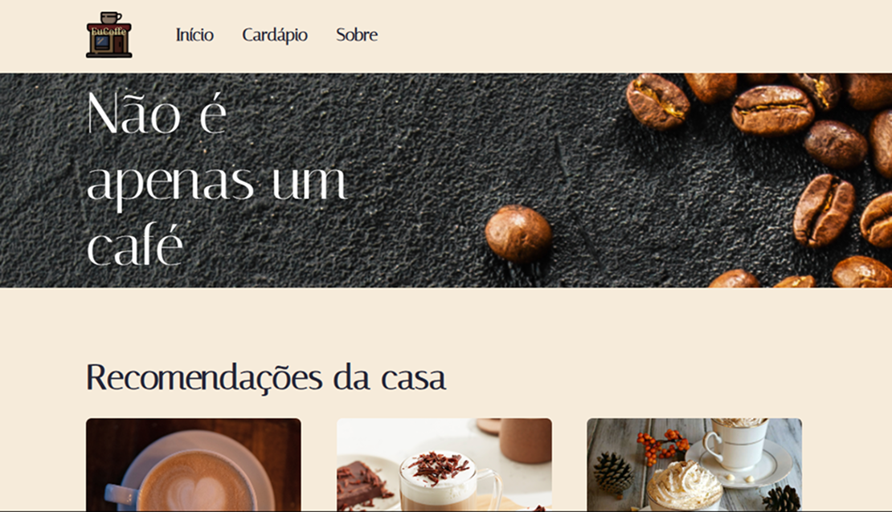
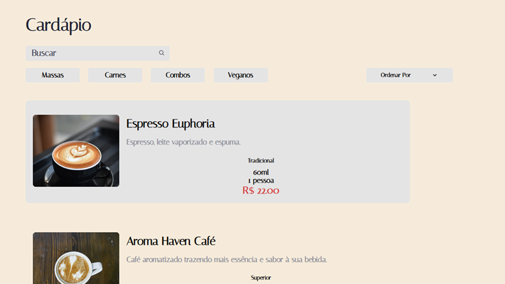
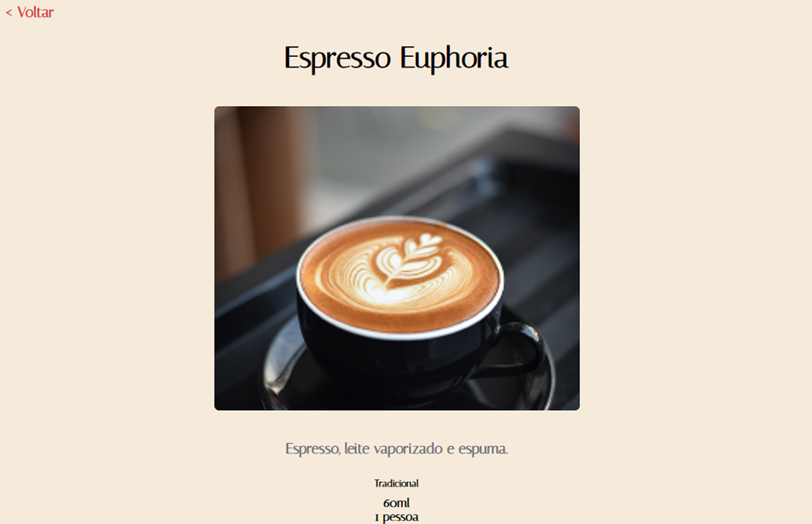
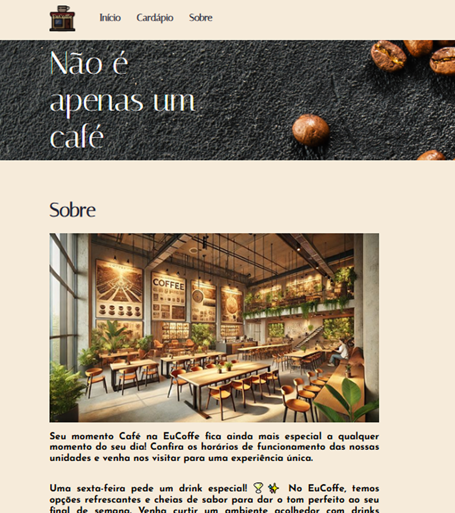

## Cafeteria EuCoffe 

Esse projeto criado com React tende de apresentar um site de cafeteria. Onde apreciadores de café podem obter detalhes e pedir o seu café favorito.



### Cardápio
O app possui um cardápio onde são listadas as opções da casa com a opção de filtro para facilitar a busca do usuário.



### Detalhes
A tela de detalhes serve para cada opção de café, uma vez selecionado será aberto uma tela de detalhamento como preço, quantidade e ingredientes da bebida.



### Sobre
Página de sobre contém informações a respeito dos valores da cafeteria além de valorizar detalhes que apenas quem é apaixonado por café entenderá.



### Projeto react-app:
Desenvolvido para simular uma cafeteria, caso queira contribuir com o projeto, pode ser criado uma Issue e/ou abrir um pedido de pull-request.

### Estilo SCSS:

para criar estilos de forma mais organizada e eficiente:

### Gostaria de rodar o projeto?

clone o repositorio
```bash
git clone https://github.com/Marvinx9/culinaria.git
```

instale as dependências
```bash
npm install |ou| yarn add
```

execute o app
```bash
npm run start |ou| yarn start
```